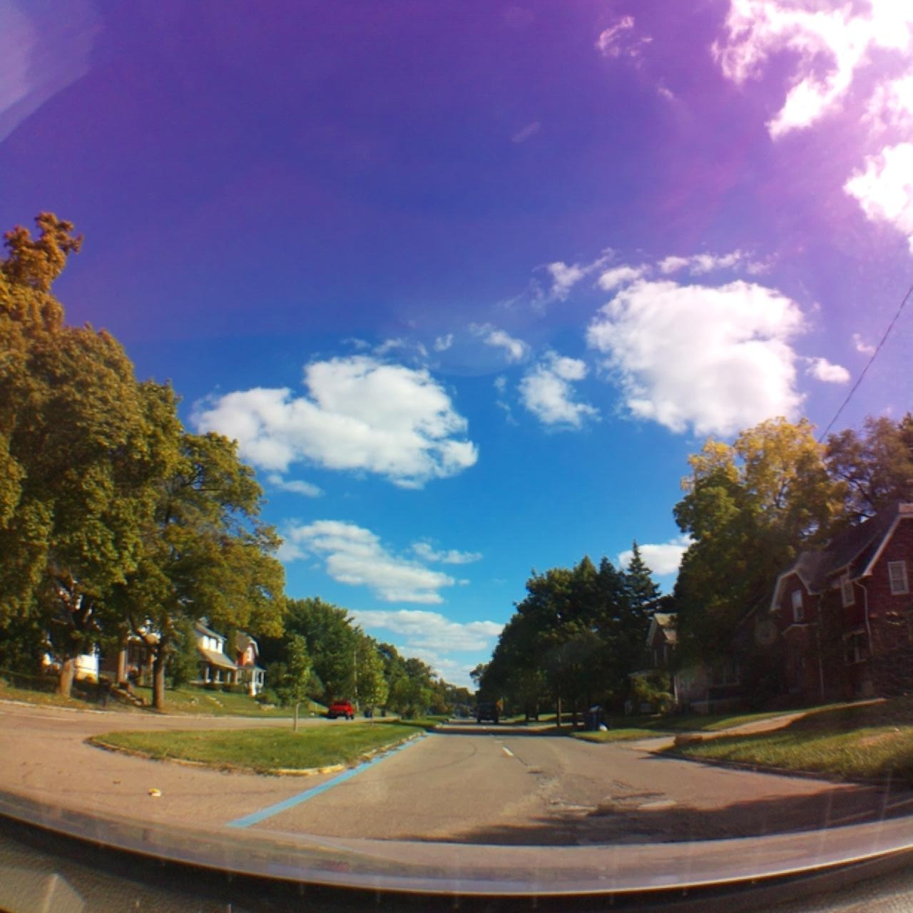
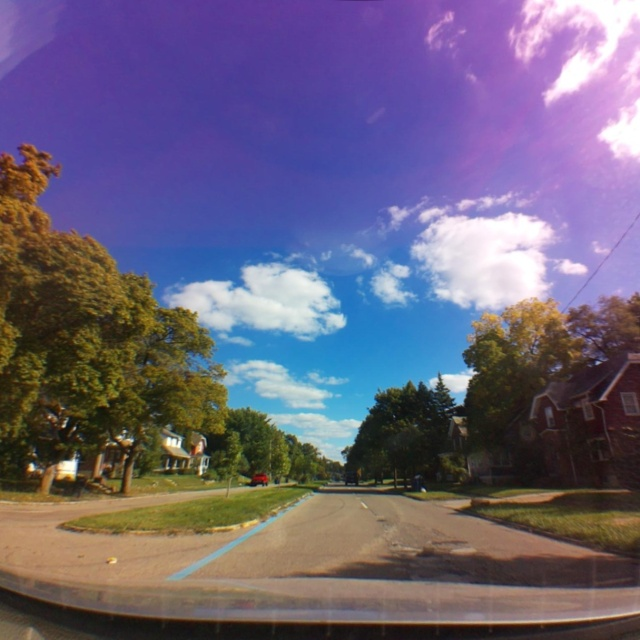

With the camera calibrated, it's easy to run YOLOPv2 on an undistorted image. 

We went from this:

to this:

All images are rotated 90 degrees clockwise, that is because the Vision 1 is mounted horizontally in the car (space constraints) and the camera cannot be rotated without twisting the ribbon cable in a way that doesn't look safe.

Using YOLOPv2, we can easily indentify the driveable area and lane zones

Of course this looks good but it's just a bunch of pixels. They need to be interpreted in a usable way.

For lanes we'll need a bird eye's view which requires a homographic transformation (will do that later)