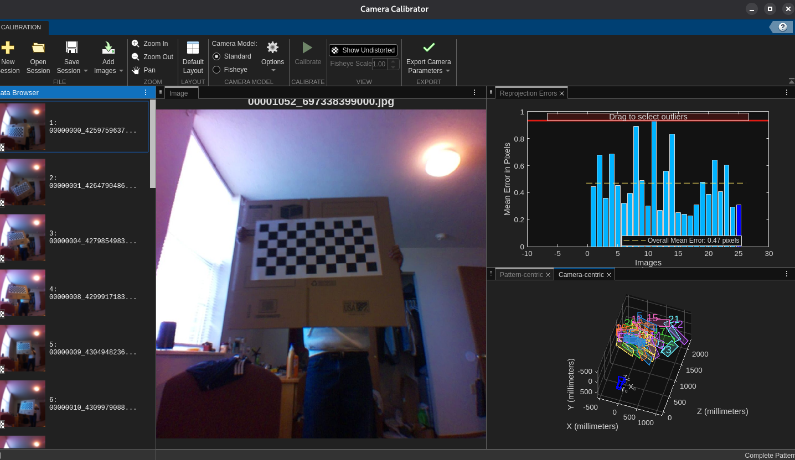

Using MATLAB, taking a bunch of pictures with a 12x6 checkerboard with pattern of size 56mm

Image size choosen as 1280x1280

Overall Mean Error at 0.47 pixels, below 1 pixels so good enough for us

## Camera parameters

Based on the [Camera Calibration App](https://www.mathworks.com/help/releases/R2025a/vision/ref/cameraparameters.html)

FocalLength [Fx Fy]: [908.3685 912.6167]
PrincipalPoint [Cx Cy]: [647.8779 576.7830]
ImageSize: [1280 1280]
RadialDistortion: [-0.3404 0.1337]
TangentialDistortion: [0 0]
Skew: 0

K Matix:

[908.3685         0  647.8779]
[0  912.6167  576.7830]
[0         0    1.0000]

From which we get
