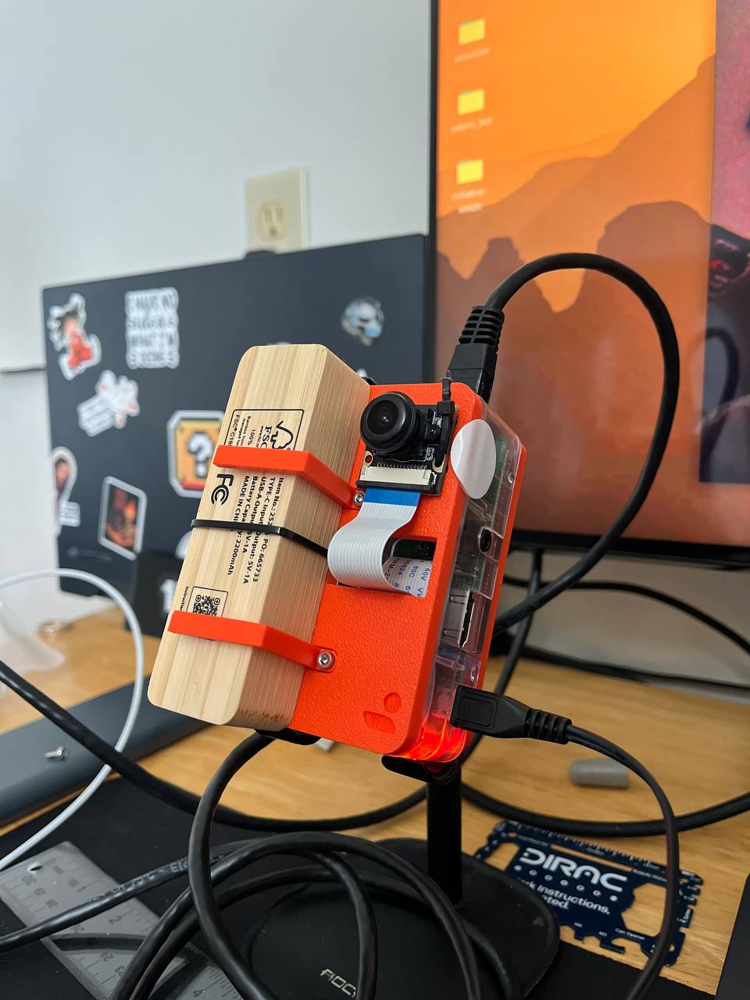
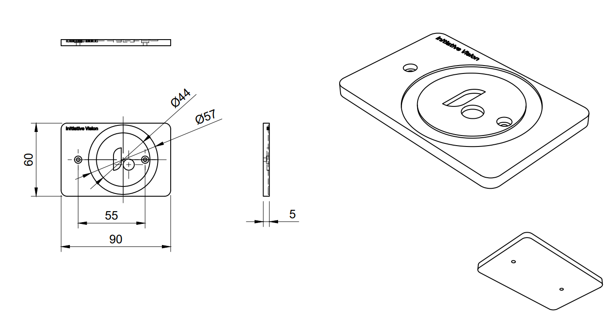
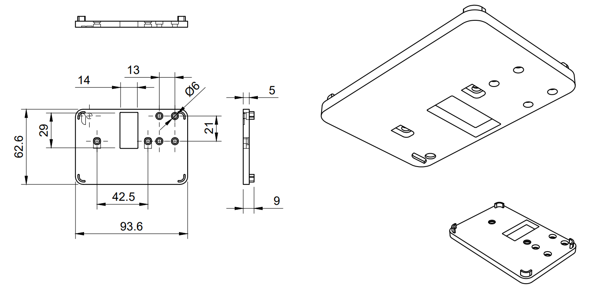

Using the existing Raspberry Pi's case and a MagSafe phone holder; the magnet was glued to a 3D printed adapter designed with Fusion 360. The back piece was adapted to fit on an already existing RPi case with 2 holes for screws. The magnet's dimensions interfered with the holes so it was shifted to the right, slight misalignment, but works great.

Similarly, the camera was mounted on a 3D-printed part replacing the original case's cover. A hole was made to let the ribbon cable come out and bend, brackets were also designed to hold the battery in place.

Using the battery was a good idea at forst but the weight caused too much vibrations so it was removed, the device is powered either with the car directly (using a 12V to 5V USB carger) or by connecting the power bank without mounting it next to the camera.

